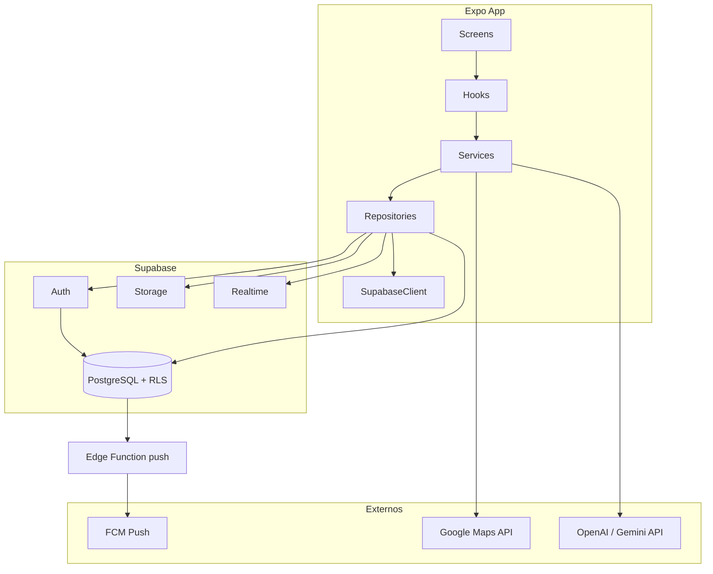

# Implementation Plan: Aplicación móvil para parejas

**Branch**: `001-couple-mobile-app` | **Date**: 2026-05-22 | **Spec**: [spec.md](./spec.md)

**Input**: Feature specification from `specs/001-couple-mobile-app/spec.md` + stack técnico (React Native/Expo, Supabase, FCM, Maps, IA opcional).

## Summary

Aplicación móvil romántica para dos personas vinculadas, con seis pantallas principales (Inicio, Calendario, Conteo de días, Deseos, Metas, Configuración), memoria compartida por fechas (eventos, ubicaciones, fotos), sincronización en tiempo real y notificaciones push. Implementación con **React Native + Expo + TypeScript** en cliente; **Supabase** (Auth, PostgreSQL, Storage, RLS, Realtime) como backend; **Expo Notifications + FCM** para push; **Google Maps** para mapas y lugares; **OpenAI o Gemini** (vía capa de servicio única) para sugerencias opcionales de texto.

## Technical Context

**Language/Version**: TypeScript 5.x strict, React Native 0.76+ vía Expo SDK 52+

**Primary Dependencies**: expo, expo-router, @supabase/supabase-js, react-native-maps, expo-image-picker, expo-image-manipulator, expo-notifications, @react-native-firebase/messaging (vía config plugin Expo), react-native-qrcode-svg, expo-camera (QR), zod, @tanstack/react-query

**Storage**: Supabase PostgreSQL (datos relacionales), Supabase Storage bucket `couple-photos` (imágenes optimizadas), AsyncStorage (caché UI y último mensaje bonito offline)

**Testing**: Jest + @testing-library/react-native (unit/hooks), MSW o mocks de Supabase (servicios), Detox o Maestro (E2E críticos: auth, vinculación, subida foto) — ver plan de pruebas en Phase 2 (`/speckit.tasks`)

**Target Platform**: iOS 15+ y Android 8+ (API 26+) mediante builds Expo/EAS

**Project Type**: mobile-app (cliente Expo) + backend gestionado Supabase (migraciones SQL en repo)

**Performance Goals**: Subida de foto con feedback <100 ms de actualización de %; listas de galería paginadas (20 ítems); Realtime latencia percibida <1 s (SC-004); UI 60 fps en navegación principal

**Constraints**: Máximo 2 miembros por pareja (DB + RLS + RPC); secretos solo en env (`EXPO_PUBLIC_*` no sensibles; claves IA/Maps en EAS Secrets); optimizar imágenes antes de Storage (ancho máx. 1920px, JPEG/WebP calidad ~0.8)

**Scale/Scope**: MVP ~15–20 pantallas/modales, 11 tablas principales + milestones, 6 tabs, flujos P1–P7 de la spec

## Constitution Check

*GATE: Must pass before Phase 0 research. Re-check after Phase 1 design.*

Reference: `.specify/memory/constitution.md` (Aplicación de Pareja v1.0.0)

| Principle | Gate (MUST pass) |
|-----------|------------------|
| I. Calidad del código | Capas: screens / components / hooks / services / repositories / types / utils / config |
| II. Pruebas | Suites planificadas: auth, pair_codes, events, photos, wishes, goals, notifications (ver research.md § Testing) |
| III. UX | Tema `themes` + tokens azul claro/rosa claro; expo-router tabs; copy de error centralizado |
| IV. Rendimiento | `expo-image-manipulator` pre-upload; progreso en `PhotoUploadService`; FlatList paginada |
| V. Seguridad | RLS por `couple_id`; validación en repositorios; Storage policies por pareja |
| VI. Mantenibilidad | Componentes compartidos (`HeartPhoto`, `ProgressBar`, `CoupleMap`); ADRs en research.md |

**Result (pre-design)**: ☑ PASS — ☐ FAIL

**Result (post-design)**: ☑ PASS — ☐ FAIL

Post-design: RLS y repositorios documentados en `contracts/`; sin violaciones que requieran Complexity Tracking.

## Project Structure

### Documentation (this feature)

```text
specs/001-couple-mobile-app/
├── plan.md              # Este archivo
├── research.md          # Decisiones técnicas Phase 0
├── data-model.md        # Esquema y entidades Phase 1
├── quickstart.md        # Setup local y Supabase
├── contracts/           # SQL, RLS, interfaces de repositorio
└── tasks.md             # Generado por /speckit.tasks (no por este comando)
```

### Source Code (monorepo)

```text
frontend/                     # Expo app (cliente móvil)
├── app/                      # Expo Router (pantallas = file-based routes)
│   ├── (auth)/               # login, register, pair-link, qr-scan
│   ├── (tabs)/               # inicio, calendario, dias, deseos, metas, config
│   ├── calendar/             # detalle día, agregar fecha/ubicación/fotos
│   └── _layout.tsx
├── src/
│   ├── components/           # UI reutilizable
│   ├── hooks/                # useCouple, usePhotoUpload, useRealtimeSync, ...
│   ├── services/             # AuthService, PairingService, ...
│   ├── repositories/         # Supabase*Repository
│   ├── types/                # DB types, zod schemas
│   ├── utils/
│   └── config/               # env, theme, supabase client
├── tests/
└── assets/

backend/                      # Supabase (infraestructura)
└── supabase/
    ├── migrations/           # SQL versionado
    ├── functions/            # Edge: send-push
    └── seed.sql
```

**Structure Decision**: Monorepo con `frontend/` (Expo) y `backend/` (Supabase CLI / migraciones). Separación estricta: pantallas solo componen UI y llaman hooks; hooks orquestan servicios; servicios aplican reglas de negocio; repositorios encapsulan Supabase/Storage/Realtime.

## Architecture Overview



## Phase Mapping (Spec → Implementation)

| Spec priority | Módulos principales |
|---------------|---------------------|
| P1 Auth + vínculo | `(auth)/*`, `PairingService`, `pair_codes` RPC, QR |
| P2 Inicio | `(tabs)/index`, agregados Realtime, `couples` settings |
| P3 Calendario | `(tabs)/calendario`, `calendar/*`, events/locations/photos |
| P4 Conteo días | `(tabs)/dias`, `milestones` |
| P5 Deseos | `(tabs)/deseos`, `wishes` |
| P6 Metas | `(tabs)/metas`, `goals` |
| P7 Config + sync | `(tabs)/config`, `notifications`, Realtime + FCM |

## Testing Strategy (constitution II)

| Dominio | Tipo | Ubicación |
|---------|------|-----------|
| Auth / sesión | Unit + integration | `AuthService`, `AuthRepository` |
| Vinculación 2 miembros | Integration + E2E | `PairingService`, RPC `join_couple_by_code` |
| Eventos / fechas | Unit | validación recordatorio 1–15 |
| Fotos | Unit + integration | optimize + upload progress |
| Deseos / metas | Unit | % progreso, estados |
| Notificaciones | Integration | insert notification + preferencias |
| RLS | SQL tests / manual checklist | `contracts/rls-policies.md` |

## Complexity Tracking

> Sin violaciones de constitución que requieran justificación.

| Violation | Why Needed | Simpler Alternative Rejected Because |
|-----------|------------|-------------------------------------|
| — | — | — |
